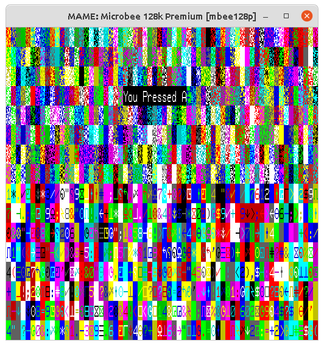

# Microbee
A simple demo to show how to create games for the Microbee computer. There are no moving parts, but demonstrates how to access the hardware.

Included is

    1. Simple crt0
    2. Display pixels, tiles and colours
    3. Sound
    4. Keyboard
    5. Creating a boot disk
    6. Running mame

# Building and Running
A Makefile is included to build and run the demo

    sudo apt install sdcc gcc automake autoconf make mame libdsk4-dev libncurses5-dev -y
    make clean
    make

The build environment has been tested on Linux only. The same code should work on Windows with sdcc.

A patched version of cpmtools-2.10 included, since the vanilla cpmtools does not support all the possible Microbee disk formats.

For more a more detailed description, see https://under4mhz.github.io/microbee/
For more information, see the Microbee Forum at https://microbeetechnology.com.au/forum/
Support me on Patreon: https://www.patreon.com/Under4Mhz

